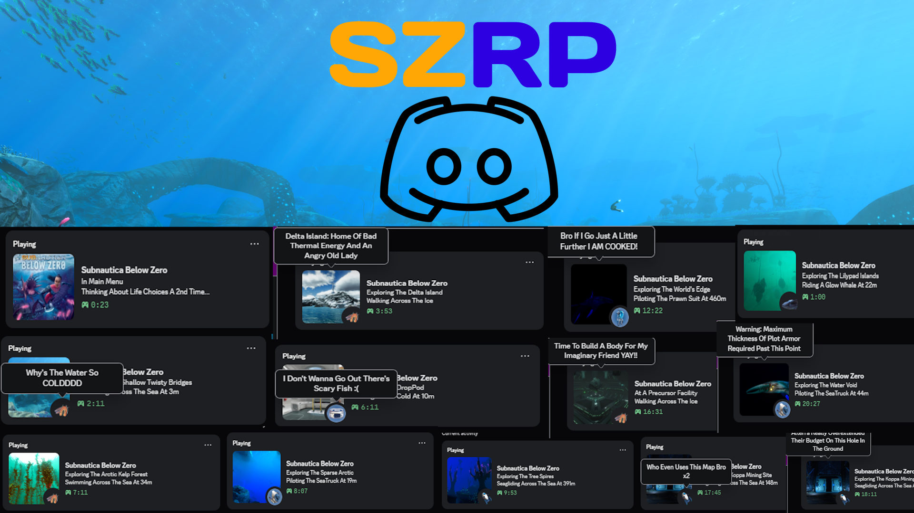

# SZRP (Subnautica Zero Rich Presence)

**A Rich Presence Integration Mod For Subnautica: Below Zero With Biome, Vehicle And Player State (Walking, Seagliding, Swimming, Riding Creature Etc.) Support!**

**This Mod Is A Subnautica: Below Zero Version Of My Original [SRP (Subnautica Rich Presence)](https://www.nexusmods.com/subnautica/mods/3607) Mod For The First Game, If You Enjoy This One, Make Sure To Check That One Out!**

***

## Features:-

- **Extensive Biomes Support:** Supports Almost All Main Biomes & Their Cave Variations With Images! (Thanks To The Subnautica Wiki).
- **Vehicle Support:** Supports All Vanilla Vehicles.
- **Player State Support:** Supports Player States Like Swimming/Seagliding, (If On Land) Walking/Running, Even Riding A Glow Whale!
- **Configurable Update Timer:** Update Timer Is Configurable.
- **(Funny) Random Hover Texts:** Multiple & Randomized Image Hover Text On Discord For All Different Types Of Situations (Mostly Unfunny Because I Am Unfunny ;( Lol)
- **Customizable Hover Texts:** You Can Customize, Add Or Remove Hover Texts To Your Liking For Each Situation!
- **Mod Manager Support:** Supports Vortex Mod Manager (This ain't even a feature bro)

## Configuration Options:-

- **Enable SZRP:** Enables Or Disables The Rich Presence
- **Enable Hover Text:** Enables Or Disables The Hover Text (In Case You Don't Like It)
- **RPC Update Interval:** Interval To Update RPC Every X Seconds (Default: 15 Seconds) [I DO NOT RECOMMENED ANYTING BELOW 15 AS DISCORD CAN RATE LIMIT IT AND IT MIGHT GET STUCK]
- ⚠️ **[DO NOT TOUCH] App ID:** Can Only Be Changed In The Config File, It Is Recommended To NOT TOUCH It As It WILL BREAK The Mod If You Do Not Have Assets For Each ID

## Installation:-

### Vortex (Recommended):-

1. Download Required Dependencies Using Their Installation Methods
2. Download This Mod Through The Files Tab Using **Mod Manager Download**
3. Enjoy!

### Manual:-

1. Download Required Dependencies Using Their Installation Methods
2. Download The Mod Archive From The Files Tab
3. Extract The Archive In Your Subnautica Game Folder
4. Enjoy!

***

## Editing Hover Texts:-

1. Go To Your `Subnautica - Below Zero/BepInEx/config/SubnauticaZeroRP` Folder [If It's Not There, Run The Game Once]
2. Open The File Named `hoverTexts.json` Using Any Text Editor
3. It Should Be In This Format
```json5
 {
    "Name": "lifepod", // Name Of The Situation
    "LargeImageText": [ // Large Image Text [If Applicable]
      "Fabricating Atomic Weapons", // List Of Texts, Add/Remove/Modify Texts Here
      "No..NO..WHERE'S MY STASIS RIFLEEEE",
      "So, Hypothecically, How Would I Make A Gun Mr. Fabricator?",
      "Glad I Didn't Fall In The Void"
    ],
    "SmallImageText": [ // Small (Bottom Right) Image Text [If Applicable]
      "A Knife And A...There's No Stasis Rifle..I AM COOKED",
      "I Don't Wanna Go Out There's Scary Fish :(",
      "Time To Conquer This Planet Again FR"
    ]
 }
```
4. Modify Or Add/Remove According To Your Liking, Make Sure Follow Json Rules So It Doesn't Crash
5. Save & Close The File
6. Make Sure To Restart Subnautica For Changes To Take Effect

**Note:** If You'd Like To Remove All The Text For Some Situation Then Simply Replace It With A `null` Like This:-
```json
 {
    "Name": "unkbiome",
    "LargeImageText": null
 }
```
**Note 2:** If You Do Edit The File, Make Sure To Have A Backup Of Your Edits Just In Case B/c The Code WILL Reset The File If The File Is Malformed.

**Note 3:** Updates May Or May Not Update The File Without Merging Changes (Untested) So Yeah Keep A Backup LOL


## Localization:-

- This Mod Supports Localization Through Nautilus' `LanguangeHandler`.
- If You'd Like To Make A Localization For Your Language OR Install A Pre-Existing Localization For Your Language Then You Can Add A `LanguageName.json` File In Your `Subnautica - Below Zero/BepInEx/plugins/SubnauticaZeroRP/Localization` Folder, Make Sure It Has The Same Format As The Pre-Exisiting `English.json` & Then You Can Edit The Text To Match Your Language.
- Similarly, Hover Texts Can Also Be Localized By Creating A `hoverTexts_LanguageName.json` File In Your `Subnautica - Below Zero/BepInEx/config/SubnauticaZeroRP` Folder, Make Sure It Has The Same Format & Version As The Original `hoverTexts.json` & Then You Can Edit The Text To Match Your Language.
- You Can Even Add/Modify/Delete Texts For The Hover Texts Localization Depending On Your Choice Similar To The English Hover Texts File.

***

## Notes:-

- This Is My Second Ever Mod So Sorry If It's A Lil Buggy Lol
- Please Report Any Bugs In The Notes/Bugs Tab
- If You'd Like Support For A Modded Vehicle/Biome, You Can Suggest It In The Notes Tab Or On My Discord
- If You'd Like To Contribute To The Mod Or If You Have Better Pictures For Certain Biomes Or More Fitting Hover Texts Then Feel Free To Suggest So On The Notes Tab Or On My Discord
- The Code Is Fully Open Source On My [Github](https://github.com/LabrynthKing/SubnauticaZeroRP)
- My Discord Username Is `labrynthking`

## TODO:-

- Add The `Of The Deep Depths` Text Back

## Credits:-

- **[Subnautica Wiki](https://wiki.subnautica.com):** All Of The In-Game Images Have Been Sourced From The Wiki, And They Deserve All The Credit.
- **[Lachee](https://github.com/Lachee):** For Their [discord-rpc-csharp](https://github.com/Lachee/discord-rpc-csharp) & [unity-named-pipes](https://github.com/Lachee/unity-named-pipes)
- **[The Nautilus BZ Dev Team](https://www.nexusmods.com/subnauticabelowzero/mods/373):** For Their GREAT Library
- **[Tobey](https://www.nexusmods.com/profile/toebeann):** For Their [BepInEx Pack For Subnautica Below Zero](https://www.nexusmods.com/subnauticabelowzero/mods/344) 